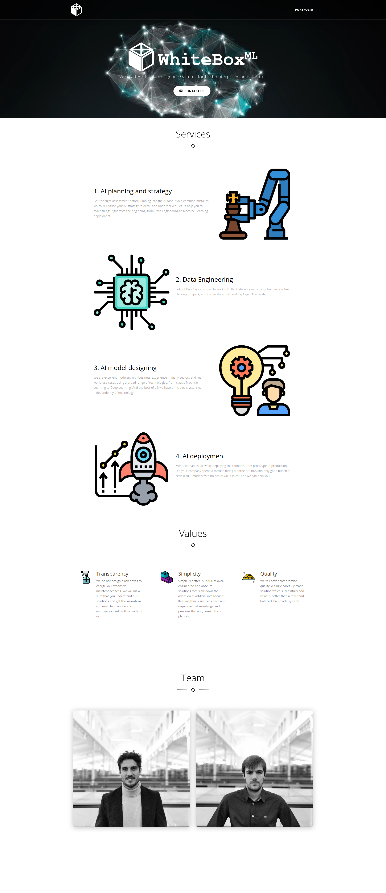

# WhiteBoxᴹᴸ website project

This is the open source repository that generates our website. Our web is a minimalistic landing
showcasing our values and portfolio.

You can check the website powered by this repository [here](https://whiteboxml.com).

The website generated by this code looks like this:

## Approach and recent changes

In its origin, our web was a Django application, but as we don't need a backend we transformed it
in a static website thanks to [django-distill](https://github.com/meeb/django-distill).

## Usage

1. Clone this repo:

    * `git clone git@github.com:whiteboxml/whiteboxml-com.git`

2. Navigate to repository:

    * `cd whiteboxml-com`
    
3. Install requirements:

    * `pip install -r requirements.txt`

4. Adapt to your use case.

5. Generate the static version of the website:

    * `python manage.py collectstatic`
    * `python manage.py distill-local [optional /path/to/export/directory]` 
    
6. Upload the static folder to your server.

7. Setup your proxy (Nginx or other) to serve these files.
